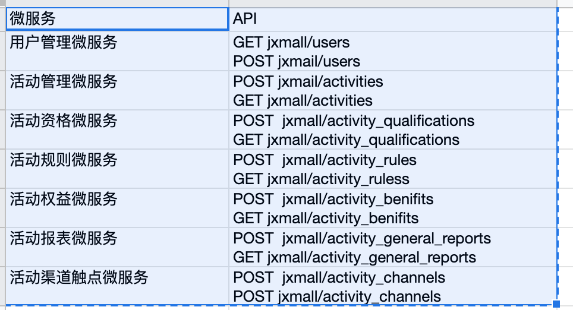
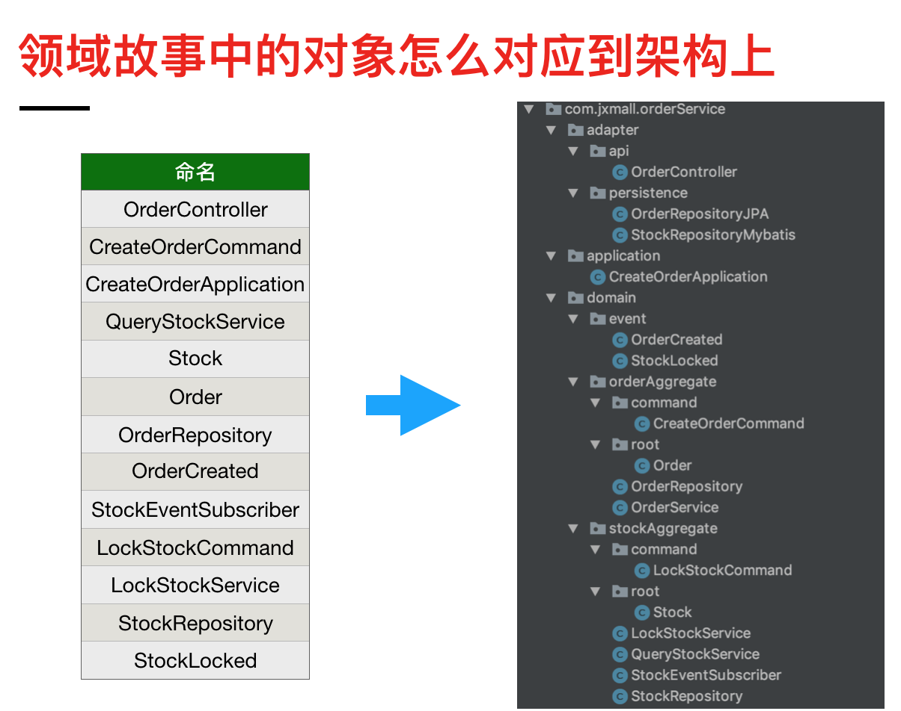

# 简要说明 
各服务与文件夹对应关系说明

领域故事与架构说明

# 使用技术:
- Spring boot
- Lombok

# 四层模型
- Adpater 适配层
- Applicaton 应用服务层
- Domain 领域层
- 基础支撑层

# 示例1：
注册用户API成功后，会调用活动管理微服务，活动管理微服务会调用活动资格微服务判断活动资格，然后调用活动规则微服务获取规则进行判断，然后调用活动权益微服务获得活动权益，最后给用户发放权益，所以这一个业务就涉及了5个微服务